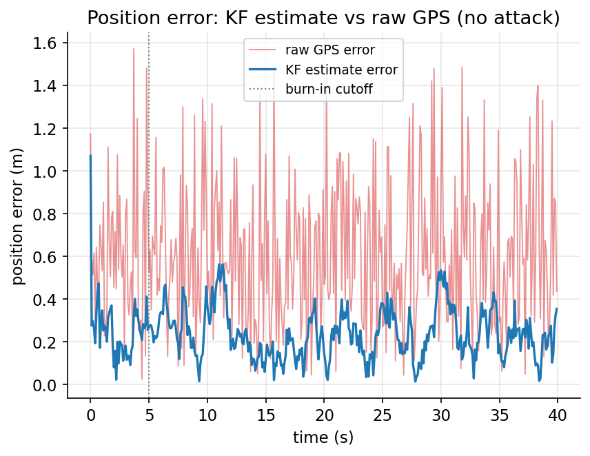
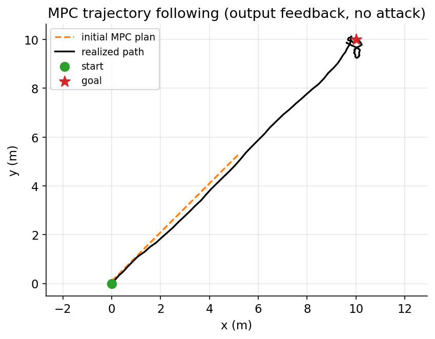
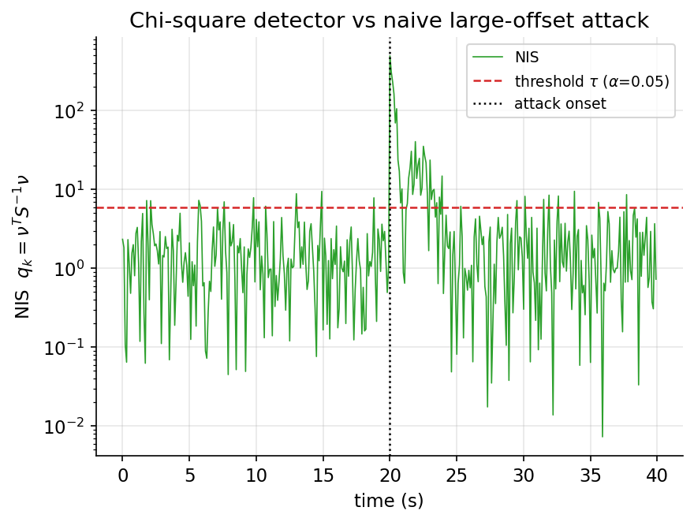
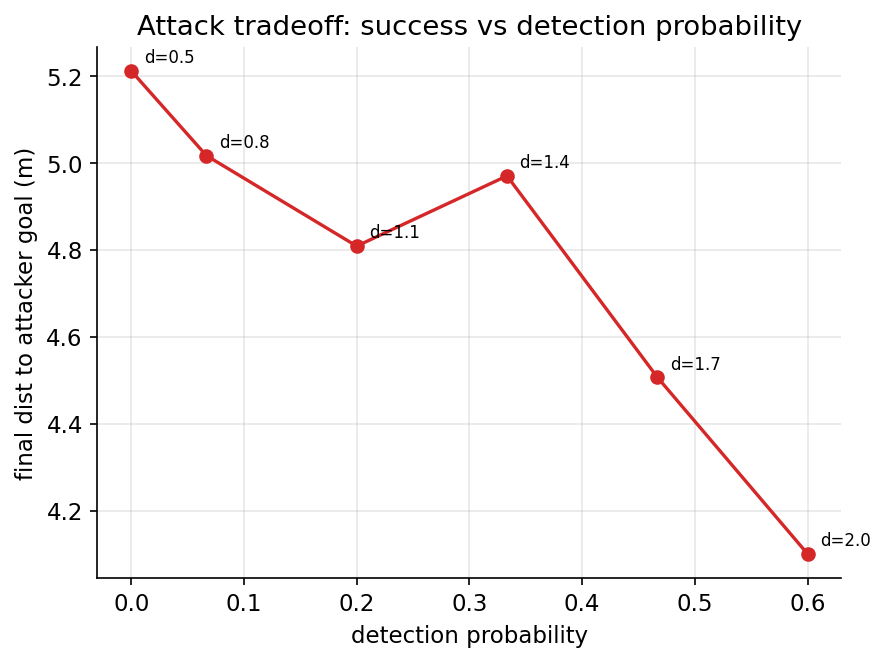

# UAV Hijacking via GPS Spoofing — Attacker–Defender Dynamics

A clean, incremental re-implementation of undergraduate research on UAV GPS
spoofing, built as a research-grade Python project. The system models the
interaction between a **defender** (a UAV running estimation, control, and
spoofing detection) and an **attacker** (an adversary injecting false GPS
measurements to hijack the UAV while evading detection).

The original paper is a reference for the *approach only*. **Every number and
figure in this repository is produced by the implementation itself** — nothing is
copied from the paper or tuned to a target. Whatever the honest simulation
produces is what is reported.

> Build status: **complete** — all four stages (Kalman filter, MPC, chi-square
> detector, evasive attacker) implemented with full Monte Carlo evaluation.
>
> Component derivations from first principles live in [`docs/design.md`](docs/design.md).

---

## System model

The UAV is a discrete-time linear **2D double integrator** with state
`x = [px, py, vx, vy]`, control `u = [ax, ay]` (commanded acceleration), and a
GPS sensor that observes **position only**:

```
x_{k+1} = A x_k + B u_k + w_k        w_k ~ N(0, Sigma_w)   (process noise)
y_k     = C x_k + d_k + v_k          v_k ~ N(0, Sigma_v)   (measurement noise)
```

`d_k` is the attack vector injected into the **measurement** — GPS spoofing
corrupts the position channel, which is exactly what `C` reads. See
`docs/design.md` §1 for the discretization.

---

## Architecture

```
src/uav_spoof/
  simulation/    dynamics.py     true plant + noise + (optional) spoofed measurement
  estimation/    kalman.py       Kalman filter state estimation
  control/       mpc.py          model predictive controller (convex QP)
  detection/     chi_square.py   chi-square spoofing detector
  attack/        evasive.py      evasive attacker (SLSQP constrained optimization)
  visualization/ plotting.py     single-claim publication figures
experiments/     common.py (config/seeds) + mc.py (Monte Carlo harness)
                 + one runnable experiment per research question
tests/           unit + statistical tests
docs/            design.md       first-principles derivations
results/         one directory per experiment: figure + metrics.json + trials.csv
```

Only `simulation/` ever touches the true state. Estimation, control, detection,
and attack layers see measurements only — exactly as a real onboard stack would.

---

## Experimental methodology

This is the part that makes the numbers trustworthy. The project draws a hard
line between two kinds of run:

- **Development runs** — a single fixed seed (`DEV_SEEDS` in
  `experiments/common.py`). Used only to render the one-seed visualization figure
  in each experiment. Never a source of a reported number.
- **Reported results** — `N = 100` independent trials, with seeds spawned
  reproducibly from a base entropy via `numpy.random.SeedSequence` (`MC_ENTROPY`).
  Every quantitative claim cites these aggregates.

Each experiment therefore emits **three** artifacts in its results directory: the
figure (one seed), `metrics.json` (aggregated statistics), and `trials.csv` (the
raw per-trial values, so any aggregate can be re-derived or re-plotted).

For every metric the harness (`experiments/mc.py`) reports **mean, std, min,
max, and a 95% confidence interval**. The CI is metric-appropriate: a Student-t
interval for continuous metrics, and a **Wilson score interval** for 0/1 outcomes
(detection success, "reached goal", etc.), which is correct near 0 or 1 where the
normal approximation fails.

Experiment design rules (applied throughout):

- one experiment = one research question
- one figure per experiment (single-claim, publication-style — no dashboards)
- one `metrics.json` + one `trials.csv` per experiment
- one output directory per experiment, regenerated independently

---

## The mathematics (summary)

Full derivations are in [`docs/design.md`](docs/design.md). In brief:

- **Kalman gain** `K = P_pred Cᵀ (C P_pred Cᵀ + R)^{-1}` is the variance-
  minimizing balance between model and sensor: it minimizes `tr(P_{k|k})`. The
  innovation `ν` and its covariance `S` are exposed because the Stage-3 detector
  is built on them.
- **MPC** solves a convex QP each step (PSD quadratic cost, affine dynamics, box
  constraints) and applies the first control. State constraints are hard with a
  soft fallback for the rare noise draw that makes the hard QP infeasible; control
  limits are always hard.
- **Chi-square detector** thresholds the normalized innovation
  `q = νᵀ S^{-1} ν ~ χ²(m)` under no attack, so the false-positive rate equals the
  significance level by construction.
- **Evasive attacker** solves a per-step convex QCQP (convex quadratic objective,
  ellipsoidal chi-square stealth constraint, norm-ball magnitude and ramp
  constraints) to drive the induced estimate bias toward `g_legit − g_att` while
  keeping `q ≤ τ`.

**Tooling:** the MPC uses **cvxpy + OSQP** (clean convex QP). The Stage-4 attacker
uses **scipy SLSQP**, because its evasion constraint couples the injected
measurement through the Kalman update and is handled directly as a nonlinear
inequality.

---

## Results

All metrics below are read directly from the generated `metrics.json` files
(N = 100 independent trials; mean ± std, with 95% CIs where noted).

### Stage 1 — Kalman filter (no attack)

| Experiment | Question | Result (N=100) |
|---|---|---|
| `trajectory_tracking` | Does the KF reconstruct the trajectory? | trajectory RMSE **0.270 ± 0.022 m** (95% CI [0.266, 0.275]) |
| `error_analysis` | How much does it reduce error vs raw GPS? | raw GPS **0.709 ± 0.020 m** → KF **0.259 ± 0.021 m**; improvement **63.4%** (95% CI [62.8, 64.0]) |
| `consistency` | Is the filter statistically consistent? | mean NIS **1.982 ± 0.103** (expected 2); **94.9%** within the 95% χ²(2) band (95% CI [94.7, 95.1]) |

The consistency result is load-bearing: under no attack the normalized innovation
`νᵀ S^{-1} ν` is χ²-distributed with `m = 2` degrees of freedom. Mean NIS sitting
at 1.98 and 94.9% of samples landing inside the 95% band means the filter's
claimed uncertainty honestly matches its real errors — which is precisely why the
Stage-3 detector (which thresholds this same statistic) will have a false-positive
rate equal to its significance level by construction.

### Stage 2 — Model Predictive Control (output feedback, no attack)

| Experiment | Question | Result (N=100) |
|---|---|---|
| `trajectory_following` | Does the MPC reach the goal? | final error **0.313 ± 0.153 m** (min 0.034, max 0.834); reached the 0.25 m settle radius in **100%** of trials (Wilson 95% CI [96, 100]) |
| `control_effort` | Effort, and within actuator limits? | total effort `∫uᵀu dt` **45.7 ± 3.7**; applied command within `a_max` (1e-3 tol) in **98%** of trials (Wilson 95% CI [93, 99]) |
| `constraint_satisfaction` | Are velocity constraints respected? | **plan** satisfies `v_max` in **100%** of trials (binds at 2.500); **realized** speed reaches **2.90 mean** (max 3.53); mean velocity-estimation error **0.56 m/s** |

The constraint experiment is the most honest result in the project. The MPC
**plan** respects the per-axis speed limit in 100% of trials (it binds exactly at
`v_max = 2.500`). The **realized** noisy trajectory exceeds it — to ~2.9 m/s on
average — and the cause is identified rather than hidden: GPS observes position
only, so the Kalman velocity estimate lags during hard acceleration (mean max
error 0.56 m/s), and the certainty-equivalence MPC plans on that estimate as if
it were the truth. Feeding the *true* state to the identical controller caps
realized speed near 2.65 m/s, confirming the gap is the cost of **output
feedback**, not a controller defect. The standard mitigation (constraint
tightening / robust MPC) is noted in `docs/design.md` but deliberately not
implemented — the project reports the straightforward design's real behavior.

### Stage 3 — Chi-square spoofing detector

| Experiment | Question | Result (N=100) |
|---|---|---|
| `false_positive_rate` | How often does it false-alarm under no attack? | per-sample FPR **0.050 ± 0.011** (95% CI [0.048, 0.053]); target α = 0.05 |
| `detection_rate` | Does it catch a naive large-offset spoofer? | detected in **100%** of trials (Wilson 95% CI [96, 100]); time-to-detect **0.0 steps**; per-sample alarm during attack **0.20** |

The detector thresholds the same NIS statistic Stage 1 validated, so its
false-positive rate equals the significance level **by construction** — and the
measurement (0.050 vs target 0.05) confirms it, with no tuning. Against a naive
attacker that injects a sudden 8 m bias, the onset produces a huge innovation and
is caught immediately in every trial. But the per-sample alarm rate across the
attack window is only 0.20, because the Kalman filter **absorbs a constant bias**:
the estimate slides toward the spoofed measurements until the innovation looks
normal again. That absorption is precisely the opening a gradual, stealthy
attacker can exploit — the motivation for Stage 4.

### Stage 4 — Evasive attacker

The attacker injects a spoofing offset `d_k` into the GPS measurement, solving a
per-step constrained optimization (scipy **SLSQP**) that drives the *induced
position-estimate bias* toward `b* = g_legit − g_att` while holding the
chi-square statistic below threshold. It exposes exactly the knobs the problem
calls for: attacker goal, attack start, max magnitude `d_max`, max change per
step `Δ_max` (ramp rate), and the chi-square stealth constraint. The detector is
the **unchanged** Stage 3 test. Full derivation in `docs/design.md` §5.

Nominal operating point: `d_max = 1.0`, `Δ_max = 0.2`, `g_att = (6, 6)` vs legit
`(10, 10)`, attack from step 30. Reported over N = 60 trials (each trial runs the
full closed loop twice — attacked and a same-noise nominal — plus a per-step
SLSQP solve, so the count is reduced from 100 for tractability; CIs reflect this).

| Experiment | Question | Result (N=60) |
|---|---|---|
| `attack_success` | Does it redirect the UAV? | final dist to legit goal **0.90 ± 0.23 m** (nominal ~0.31 m); final dist to attacker goal **4.79 ± 0.24 m** |
| `stealthiness` | Does it evade the detector? | alarm rate **0.055** (≈ α = 0.05); detection rate **7%** (Wilson 95% CI [3, 16]) vs a **2.5%** no-attack floor; time-to-detect ~95 steps (late) |
| `destination_deviation` | How far off the nominal path? | max deviation **1.28 ± 0.09 m**; final **0.90 m**; average **0.84 m** |
| `tradeoff_study` | Success vs detection as `d_max` sweeps | monotone Pareto: `d_max` 0.5 → 2.0 ⇒ detection **0% → 60%**, final dist to attacker goal **5.21 → 4.10 m**, alarm rate **0.049 → 0.115** |

The detection metric uses a calibrated persistence monitor (≥4 per-sample alarms
within 10 steps), whose no-attack false-trigger floor is ~2.5% — chosen
deliberately because the looser ≥3-in-10 rule false-triggers 21% of the time over
the 100-step window and would have made "detection" mostly baseline noise. This
correction matters: under the calibrated rule the stealthy attack is detected
only 7% of the time, barely above the floor.

**The honest headline.** Against a well-calibrated chi-square detector, a provably
stealthy attacker's impact is *fundamentally limited*. It can bias the vehicle by
~1 m while sitting at the noise floor, but driving the UAV all the way to the
attacker's goal demands spoofing aggressive enough to be caught — exactly the
tension the tradeoff study quantifies. The ramp-rate constraint is what defeats
the onset spike that exposed the naive Stage 3 attacker; the residual divert is
the price the detector cannot avoid paying.

## Figures

**Stage 1 — Kalman filter position error vs raw GPS**


**Stage 2 — MPC trajectory to goal**


**Stage 3 — Chi-square detector vs naive attacker (log scale)**


**Stage 4 — Attack success vs detection probability (Pareto tradeoff)**


---

## Setup

### Virtual environment + install

```bash
python3 -m venv .venv
source .venv/bin/activate            # Windows: .venv\Scripts\activate
pip install --upgrade pip
pip install -e ".[dev]"              # package + pytest
```

(Or `pip install -r requirements.txt` for runtime deps only.)

### Run the tests

```bash
pytest
```

### Reproduce every experiment (each regenerates only its own outputs)

```bash
# Stage 1 — Kalman filter
python -m experiments.stage1_kalman.exp1_trajectory_tracking
python -m experiments.stage1_kalman.exp2_error_analysis
python -m experiments.stage1_kalman.exp3_consistency

# Stage 2 — MPC
python -m experiments.stage2_mpc.exp1_trajectory_following
python -m experiments.stage2_mpc.exp2_control_effort
python -m experiments.stage2_mpc.exp3_constraint_satisfaction

# Stage 3 — Chi-square detector
python -m experiments.stage3_detection.exp1_false_positive_rate
python -m experiments.stage3_detection.exp2_detection_rate

# Stage 4 — Evasive attacker
python -m experiments.stage4_attack.exp1_attack_success
python -m experiments.stage4_attack.exp2_stealthiness
python -m experiments.stage4_attack.exp3_destination_deviation
python -m experiments.stage4_attack.exp4_tradeoff_study
```

Each command writes `results/<stage>/<experiment>/{<figure>.png, metrics.json,
trials.csv}` and prints its headline aggregates. Seeds are fixed in
`experiments/common.py`, so runs are deterministic and reproducible. Stage 1
experiments are fast; each Stage 2 experiment runs 100 closed-loop trials and
takes roughly a minute.

---

## Roadmap

- [x] **Stage 1 — Kalman filter:** estimation + statistical-consistency validation
- [x] **Stage 2 — MPC:** trajectory following, control effort, constraint satisfaction
- [x] **Monte Carlo evaluation framework:** independent seeds, per-trial storage, CIs
- [x] **Stage 3 — Chi-square detector:** false-positive rate (no attack), detection
      rate vs a naive large-offset attacker
- [x] **Stage 4 — Evasive attacker:** constrained-optimization spoofing — attack
      success, stealthiness, destination deviation, and a success-vs-detection
      tradeoff study
